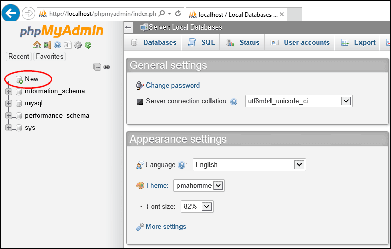

# Create a new database in phpmyadmin

To create new database ,click new on the left-hand side of phpMyAdmin:

 Type a name for your database, where it says "Create database"This will create a new blank database

