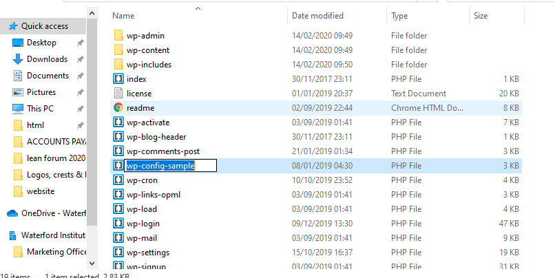

# Install Wordpress

Once the server is setup and a new database is in place we can install Wordpress cms . First of all we need to down the Wordpress files . We can do that here : [Download Link](https://wordpress.org/download/)

This will download Wordpress in a zip file , once this is done we must extract the folder on to our computer and copy the extracted files into out webserver root.

At this point we need to change the name of the Wordpress default config file in the website root . Change it from **wp-config-sample** to **wp-config**

