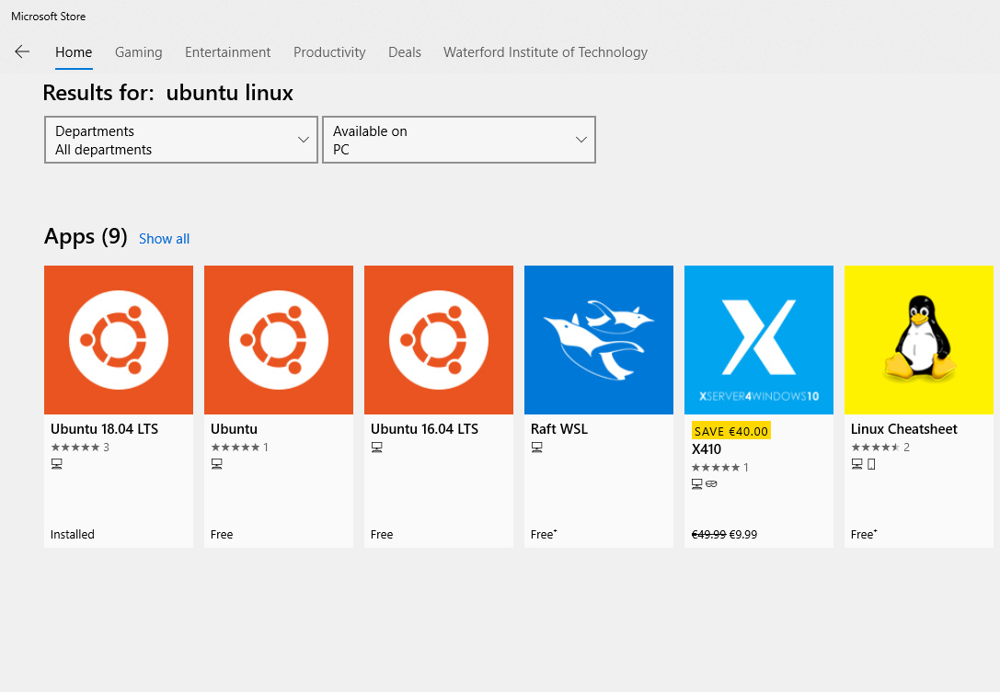

# Installing Linux using Microsoft Store

Open **Microsoft Store**.

Search for the Linux distribution that you want to install. Some of the distros available include:

* [Ubuntu](https://www.windowscentral.com/e?link=https%3A%2F%2Fmicrosoft.msafflnk.net%2Fc%2F159229%2F433017%2F7593%3FsubId1%3DUUwpUdUnU72700YYwYg%26subId2%3Ddwp%26u%3Dhttps%253A%252F%252Fwww.microsoft.com%252Fen-us%252Fp%252Fubuntu%252F9nblggh4msv6%26ourl%3Dhttps%253A%252F%252Fwww.microsoft.com%252Fstore%252FproductId%252F9NBLGGH4MSV6&token=ofL491cV).
* [OpenSuse Leap 15](https://www.windowscentral.com/e?link=https%3A%2F%2Fmicrosoft.msafflnk.net%2Fc%2F159229%2F433017%2F7593%3FsubId1%3DUUwpUdUnU72700YYwYg%26subId2%3Ddwp%26u%3Dhttps%253A%252F%252Fwww.microsoft.com%252Fen-us%252Fp%252Fopensuse-leap-15-1%252F9njfzk00fgkv%26ourl%3Dhttps%253A%252F%252Fwww.microsoft.com%252Fstore%252FproductId%252F9NJFZK00FGKV&token=9zG82Cz6).
* [Kali Linux](https://www.windowscentral.com/e?link=https%3A%2F%2Fmicrosoft.msafflnk.net%2Fc%2F159229%2F433017%2F7593%3FsubId1%3DUUwpUdUnU72700YYwYg%26subId2%3Ddwp%26u%3Dhttps%253A%252F%252Fwww.microsoft.com%252Fen-us%252Fp%252Fkali-linux%252F9pkr34tncv07%26ourl%3Dhttps%253A%252F%252Fwww.microsoft.com%252Fstore%252FproductId%252F9PKR34TNCV07&token=CwiA3qTJ).
* [Debian](https://www.windowscentral.com/e?link=https%3A%2F%2Fmicrosoft.msafflnk.net%2Fc%2F159229%2F433017%2F7593%3FsubId1%3DUUwpUdUnU72700YYwYg%26subId2%3Ddwp%26u%3Dhttps%253A%252F%252Fwww.microsoft.com%252Fen-us%252Fp%252Fdebian%252F9msvkqc78pk6%26ourl%3Dhttps%253A%252F%252Fwww.microsoft.com%252Fstore%252FproductId%252F9MSVKQC78PK6&token=Uzxq149U).
* [Alpine WSL](https://www.windowscentral.com/e?link=https%3A%2F%2Fmicrosoft.msafflnk.net%2Fc%2F159229%2F433017%2F7593%3FsubId1%3DUUwpUdUnU72700YYwYg%26subId2%3Ddwp%26u%3Dhttps%253A%252F%252Fwww.microsoft.com%252Fen-us%252Fp%252Falpine-wsl%252F9p804crf0395%26ourl%3Dhttps%253A%252F%252Fwww.microsoft.com%252Fstore%252FproductId%252F9P804CRF0395&token=NriypPhO).
* [Suse Linux Enterprise 12](https://www.windowscentral.com/e?link=https%3A%2F%2Fmicrosoft.msafflnk.net%2Fc%2F159229%2F433017%2F7593%3FsubId1%3DUUwpUdUnU72700YYwYg%26subId2%3Ddwp%26u%3Dhttps%253A%252F%252Fwww.microsoft.com%252Fen-us%252Fp%252Fsuse-linux-enterprise-server-12%252F9p32mwbh6cns%26ourl%3Dhttps%253A%252F%252Fwww.microsoft.com%252Fstore%252FproductId%252F9P32MWBH6CNS&token=SUSyDuEn).

Select the Ubuntu 18.40 LTS to install on your device

