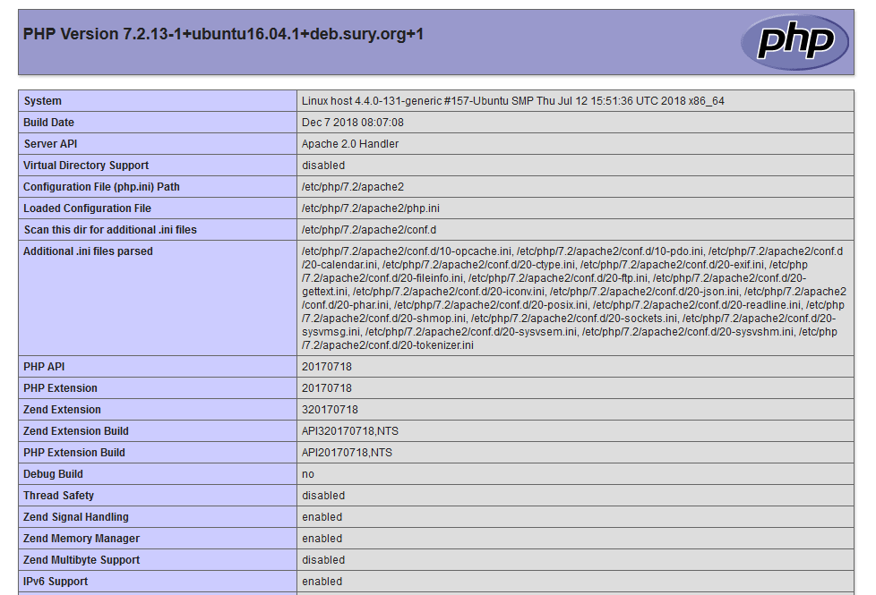

# Installing PHP

PHP is the component of your setup that will process code to display dynamic content. It can run scripts, connect to your MySQL databases to get information, and hand the processed content over to your web server to display.

Once again, leverage the `apt` system to install PHP. In addition, include some helper packages this time so that PHP code can run under the Apache server and talk to your MySQL database

```text
apt install php libapache2-mod-php php-mysql
```

This will install the most up to date stable version of PHP  for Linux Server 18.04 which is 7.2

### Testing PHP setup 

So once we have setup php we want to check that it is working . Open a text file and paste in this code 

```text
<?php

// Show all information, defaults to INFO_ALL
phpinfo();

?>
```

Now save this file as info.php  and paste it into you web server file root \( where you have put your index.html file\).The restart Apache using this command 

```text
service apache2 restart 
```

No go to the **localhost/info.php** in the browser and you should see the php information  page below . So now php is working



