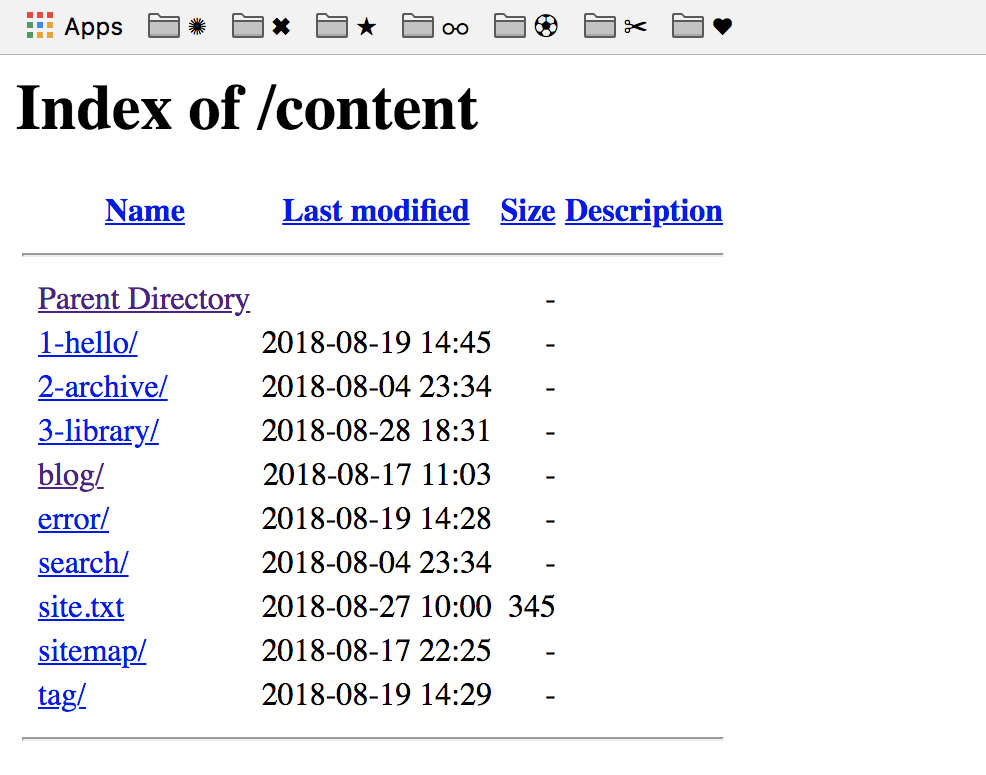

# Linking a project directory with your server directory

On the last page we found the Linux file system  in windows , but it is a hidden file and buried deep withing the windows folder structure.

 So to simplify our process we are going to create a working directory within windows and link that directory with your WSL Apache server. 

**Step 1:** We are going to make a directory for our files

```text
mkdir /mnt/c/Users/windows-user-name-here/Documents/webserver
```

**Step 2:** Now we are going to create a [Symbolic Link](https://linuxize.com/post/how-to-create-symbolic-links-in-linux-using-the-ln-command/) __to that folder 

```text
ln -s /mnt/c/Users/windows-user-name-here/Documents/webserver  /var/www/html
```

At this point if you open localhost in the browser you get a directory view like below. This is because you are opening the file in the browser but its not being served by the Apache webserver 



So we need to tell Apache where out new document root is , to do this we need to by editing two Apache files . We will user [Nano](https://www.howtogeek.com/howto/42980/the-beginners-guide-to-nano-the-linux-command-line-text-editor/) the Linux command line text editor 

```text
nano /etc/apache2/apache2.conf
```

At the bottom of that file we can see the root directory is pointing to **/var/www/html ,** change this to where your new document route

```text
<Directory /mnt/c/Users/windows-user-name-here/Documents/webserver>
        AllowOverride None
        Require all granted
</Directory>

```

Now open the second file 

```text
nano /etc/apache2/sites-available/000-default.conf
```

In the middle of that file we can see the Document Root is pointing to **/var/www/html ,** change this to where your new document route

```text
ServerAdmin webmaster@localhost
DocumentRoot /mnt/c/Users/bhackett/Documents/webserver
```

Now create a new index.html file 

Open a new text file and past in this content 

```text
<html>
<header><title>hello world</title></header>
<body>
<strong>Hello world this is a html test</strong>
</body>
</html>
```

Save the file as index.html and copy  and paste this file into your new webserver document root. The restart the apache server

```text
service apache2 restart  
```

Now is you go to localhost in your browser you should see the hello world  html page 

