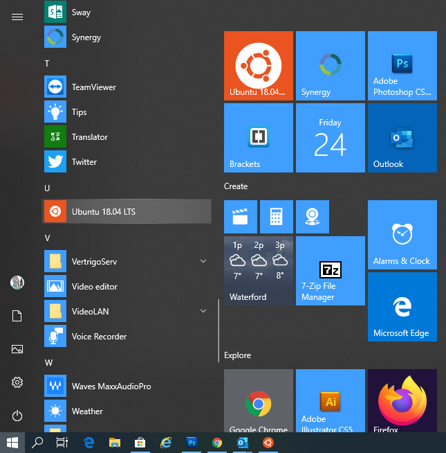

# Setting up a user account

You should now be able to run Ubuntu as a program, you can pick it off the windows start menu  




 A warning, **choose a username that is different than any of your Windows usernames**; I’ve encountered weird permission issues when having the same username for both, plus it gets confusing on the command line if you see the same username everywhere.


Once you run the Ubuntu program it will begin setup and ask you to create a user and setup a password. This user has full root level permissions using **sudo** command 


Once you have setup a user then begin by updating Ubuntu and outdated packages using this command 

```bash
sudo apt update && sudo apt -y upgrade
```

