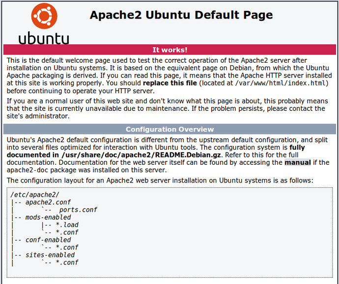

# Setup Apache Webserver

Apache is an open-source and free web server software that [powers around 46% of websites](https://w3techs.com/technologies/details/ws-apache/all/all) around the world. The official name is [Apache HTTP Server](https://httpd.apache.org/), and it’s maintained and developed by the Apache Software Foundation.

It allows you to serve content on the web — hence the name “web server”. It’s one of the oldest and most reliable web servers, with the first version released in 1995.

 Install the `apache2` package by typing the following command into the terminal and pressing enter 

```text
sudo apt-get install apache2
```

By default, Apache puts a test HTML file in the web folder that you will be able to view from your browser on your computer.

Open the Apache default web page in your web browser : and Enter this address `http://localhost`

You should see a page like this 



Use the command below to get Apache to run on bootup so you dont have to manually start it every-time 

```text
systemctl enable apache2
```

