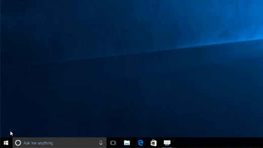

# Finding the Linux file system

By default the Linux file system is in a hidden folder so you need to turn on hidden files in file exporter options

* Open **File Explorer** from the taskbar. 
* Select **View** &gt; **Options** &gt; **Change folder and search options**.
* Select the **View** tab and, in **Advanced settings**, select **Show hidden files, folders, and drives** and **OK**.

The linux file root is located here 


**C:\Users\yourusername\AppData\Local\Packages\CanonicalGroupLimited.Ubuntu18.04onWindows\_\(a unique code based on your setup\) \LocalState\rootfs**


