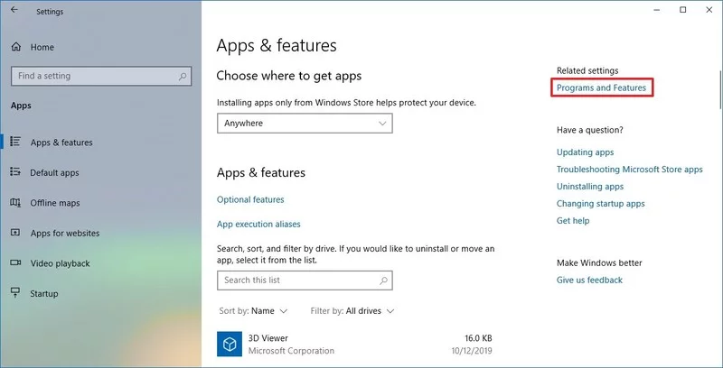
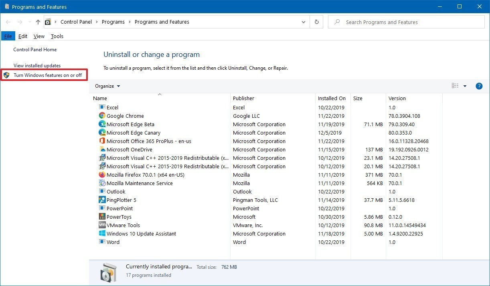
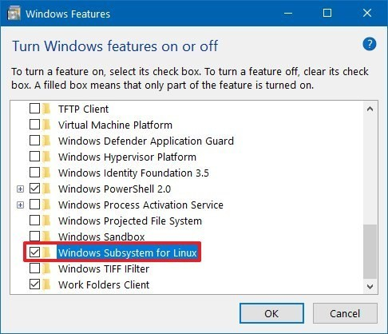

# Setup

#### How to install Windows Subsystem for Linux using Settings

If you want to run distros of Linux on Windows 10, you must first enable the Windows Subsystem for Linux feature before you can download and install the flavor of Linux that you want to use.

#### Enabling Windows Subsystem for Linux using Settings

To install WSL using Setting on Windows 10, use these steps:

1. Open **Settings**.
2. Click on **Apps**.
3. Under the "Related settings" section, click the **Programs and Features** option

 Click the **Turn Windows features on or off** option from the left pane.

 Check the **Windows Subsystem for Linux** option.

