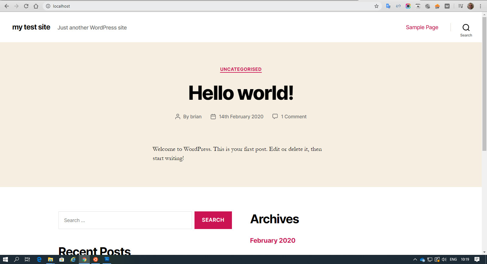

# Wordpress setup

Now when we go to **http://localhost** and we should see the Wordpress setup page ****

We now go the to the Wordpress setting page and we setup the site name and Wordpress username and password 

Once you enter your settings click install Wordpress and if it successful you should see this screen 

Click login to go to the Wordpress login screen and use your newly created Wordpress username and password to login 

The default Wordpress  theme is installed and you should see the default site when you go to localhost 

