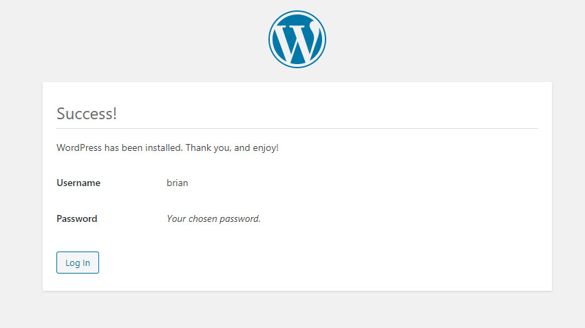

# Wordpress setup

Now when we go to **http://locahost** and we should see the wordpress setup page ****

We now go the to the wordpress setting page and we setup the site name and wordpress username and password 

Once you enter your settings click install wordpress and if it sucessful you should see this screen 

