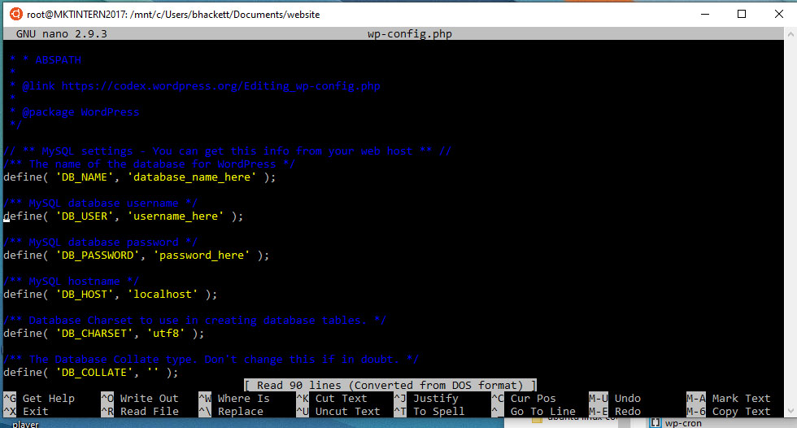

# wp-config settings

Now we need to setup the wp-config with our database setting. So change directory to our mounted drive

```text
 cd  /mnt/c/Users/your-user-name/Documents/website
```

We now new to edit the config file 

```text
 nano wp-config.php
```



We need to change DB\_NAME to the database name we created in phpmyadmin

We need to change DB\_USER to the database super user we created 

We need to change DB\_PASSWORD to the super user password 


